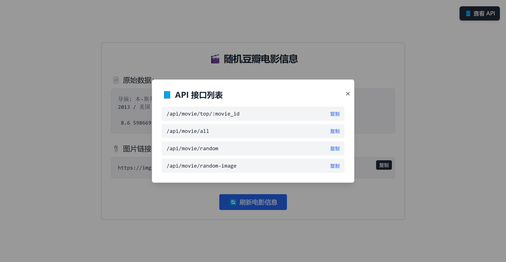
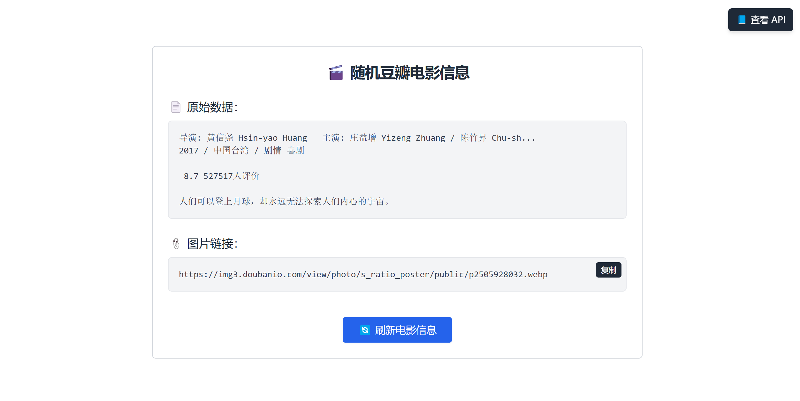

# Douban-Top250 Go Server

> Copyright © 2025 Douban Company.
> For learning and exchange purposes only.

[To Python](README-py.md)

## Table of Contents
- [Description](#description)
- [Features](#features)
- [Installation](#installation)
- [Usage](#usage)
- [API Endpoints](#api-endpoints)
- [Contributing](#contributing)
- [License](#license)

## Description
Douban Go Server is a backend service built in Go that provides movie-related data from Douban. It serves as an API to fetch movie details, lists, and random selections.

## Features
- Fetch detailed information about a specific movie by ID.
- Retrieve a list of all movies.
- Get a random movie.
- Obtain a random movie image.

## Installation
To install and run Douban Go Server, follow these steps:

1. **Clone the Repository**
   ```sh
   git clone https://github.com/yourusername/douban-goserver.git
   cd douban-goserver
   ```

2. **Install Dependencies**
   Ensure you have Docker and Docker Compose installed on your machine. You can download them from the official websites:
   - [Docker](https://www.docker.com/products/docker-desktop)
   - [Docker Compose](https://docs.docker.com/compose/install/)

3. **Build and Run the Docker Container**
   ```sh
   docker-compose up --build
   ```

   This command will build the Docker image and start the container. The server will be accessible at `http://localhost:8080`.

4. **Stopping the Server**
   To stop the server, you can press `Ctrl+C` in the terminal where `docker-compose up` is running, or you can run:
   ```sh
   docker-compose down
   ```

## Usage
Once the server is running, you can interact with it via the following API endpoints. Here are some example requests:

- **Get Movie by ID**
  ```sh
  curl http://localhost:8080/api/movie/top/12345
  ```

- **Get All Movies**
  ```sh
  curl http://localhost:8080/api/movie/all
  ```

- **Get Random Movie**
  ```sh
  curl http://localhost:8080/api/movie/random
  ```

- **Get Random Movie Image**
  ```sh
  curl http://localhost:8080/api/movie/random-image
  ```

You can also use tools like Postman or your browser to make these requests.

## API Endpoints
- **GET /api/movie/top/:movie_id**: Fetches detailed information about a specific movie by its ID.
- **GET /api/movie/all**: Retrieves a list of all movies.
- **GET /api/movie/random**: Gets a random movie.
- **GET /api/movie/random-image**: Obtains a random movie image.

## Contributing
Contributions are welcome! Please follow these guidelines when contributing to Douban Go Server:

1. Fork the repository.
2. Create a new branch for your feature or fix.
3. Commit your changes.
4. Push to your branch.
5. Open a pull request.

## License
This project is licensed under the MIT License - see the [LICENSE](LICENSE) file for details.



